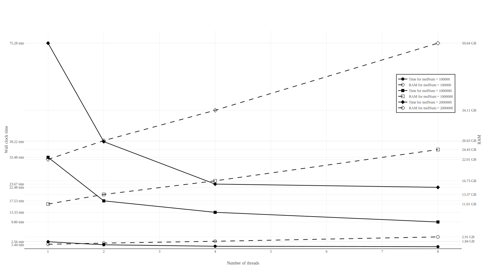

# Calib thread scalability
Calib is multithreaded. However, its time and memory efficiency drops with increasing number of threads:


Currently, multithreading is performed by generating all possible masks on the main thread. 
For barcode length 4 (4+4), and error tolerance of 1, there are eight such masks:
```
01111111
10111111
11011111
11101111
11110111 
11111011 
11111101 
11111110 
```
Any two nodes in Calib graph that have identical barcodes after applying a mask, and after having sufficient number of minimizers (check the main README file [here](../../)).
Thus, each mask implies a set of edges on Calib's graph.
Note that these sets of edges are not necessarily disjoint, especially of error tolerance is > 1.

Calib's multithreading is done by assigning each thread a subset of masks (no two threads will share a subset of course).
Each thread will then use its own masks to generate a local version of the graph that is implied by these masks.
Once a thread completes computing its graph on all its masks, it will lock the main Calib's graph, and copy its local graph's edges to the main graph's edges.
This comes with the downside of using more RAM with every extra thread used as shown in the tests plotted up here.
The plot is generated from the scripts in [here](../../slurm_scripts/).
The exact results are in the the TSV files in this directory.
